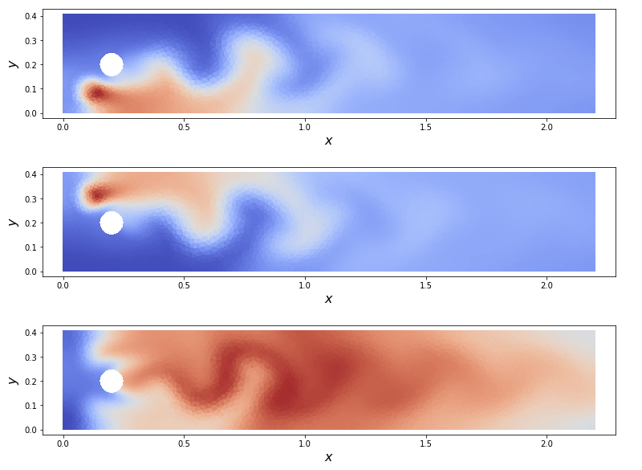
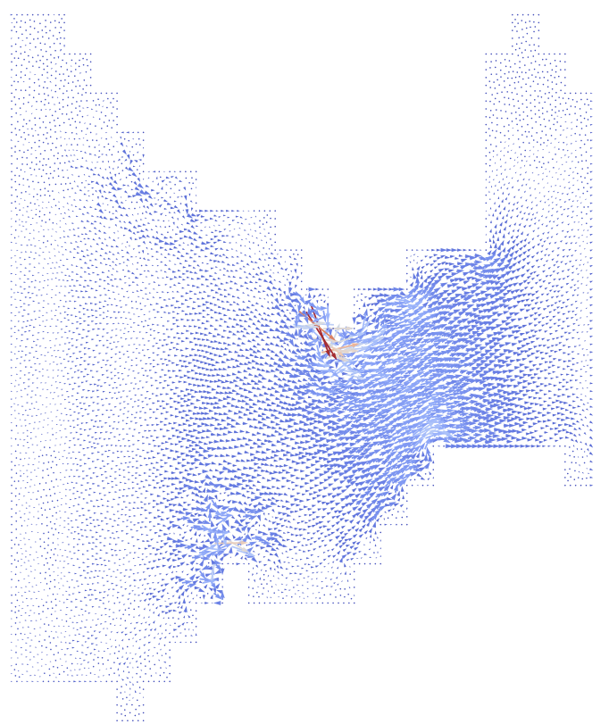

### Build Status
[](https://travis-ci.com/msc-acse/acse-9-independent-research-project-kmei92)



## Introduction
Fireframe is a programmable framework built on top of the Firedrake finite element library. Firedrake aims to automate the process
of setting up function spaces, creating finite elements, and performing manufactured solutions testing.
The goal of Fireframe is to allow users to quickly and efficiently analyze different combinations of coupled partial differential equations.

Included in this repository are demonstration notebooks that highlight how to pose Firedrake problems using Fireframe.

Example problems are presented and solved, including:
 - A simple channel flow navier-stokes equation (see: acse/fireframe/demo/flow_past_cylinder_demo.ipynb)
 - A poisson equation (see: acse/fireframe/demo/poisson_temp_demo.ipynb)
 - A three component chemical reactions  equation coupled to the navier-stokes equation (see: acse/fireframe/demo/cylinder_rxn_demo.ipynb)
 - A radionuclide transport equation coupled to the navier-stokes equation (see: acse/fireframe/demo/radio_transport_demo.ipynb)
 - A radionuclide transport equation coupled to the shallow water equation (see: acse/fireframe/demo/hydrodynamics_demo.ipynb)
 - A method of manufactured solutions verification on the radionuclide transport problem (see: acse/fireframe/demo/MMS_transport/demo.ipynb)

## Installation instructions
In order to use Fireframe, please first install the latest version of Firedrake [here](https://www.firedrakeproject.org/download.html)

To download Fireframe:
```bash
  git clone https://github.com/msc-acse/acse-9-independent-research-project-kmei92.git
```
Before attempting to use Fireframe or any Firedrake functions, activate the Firedrake virtualenv first:
```bash
  source firedrake/bin/activate
```
To use Fireframe, import the following:
```python
from PDESystem import *

from PDESubsystem import *

from pdeforms import *
```
## Documentation
For the latest build of Fireframe documentation, visit [here](https://fireframe.readthedocs.io/en/latest/index.html)

## Dependencies
Fireframe relies on the following external libraries:

 - numpy >= 1.16.4
 - sympy >= 1.4
 - matplotlib >= 3.1.0
 - jupyter >= 1.0.0 (to run demo notebooks)

## Repository Information
* __docs__				- all files required to compile the documentation for fireframe
* __tests__				- pytest file to check whether core functionality of PDESystem, PDESubsystem, and pdeforms are intact
* __acse__				- main repository
    * __acse__/meshes/			- all mesh files used in the tests and the demostrations
    * __acse__/fireframe/		- main module containing PDESystem, PDESubsystem, and pdeforms
        * __acse__/fireframe/demo	- all demonstration examples 

## Author and Course Information
__Author:__ Keer Mei
__Github:__ kmei92
__CID:__ 01545321

This project is completed for Imperial College's MSc in Applied Computational Science and Engineering program,
as part of the final course module ACSE9. This project was completed under and supervision of Professor Matthew Piggott. 
## License
Fireframe is licensed under the MIT [license](https://github.com/msc-acse/acse-9-independent-research-project-kmei92/blob/master/LICENSE)

